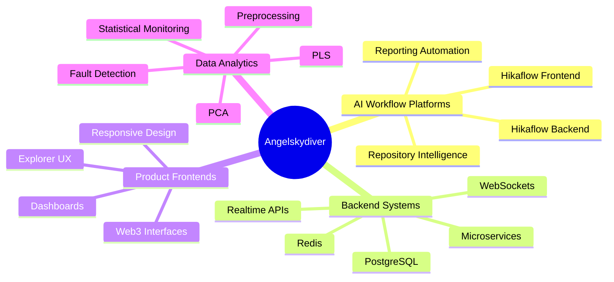

<div align="center">


<a href="https://github.com/angelskydiver">
  
</a>

<br />


</div>

---

<div align="center">

##  About Me

</div>

<table>
<tr>
<td width="58%">

### I build software that feels complete.

I work across backend platforms, frontend products, AI-assisted engineering workflows, Web3 user experiences, realtime systems, and data analytics. My priority is not only writing code, but shaping systems that are readable, reliable, useful, and ready to evolve.

```txt
System Thinking      APIs, services, data flows, product boundaries
Frontend Craft       dashboards, workflows, responsive interfaces
Backend Delivery     auth, billing, reporting, integrations, automation
Data Intelligence    preprocessing, analytics, PCA, PLS, monitoring
Product Quality      documentation, deployment, observability, testing
```

</td>
<td width="42%" align="center">


<br /><br />

<br />

<br />


</td>
</tr>
</table>

---

<div align="center">

## Tech Arsenal


<br /><br />


</div>

---

<div align="center">

## Signature Projects

</div>

<table>
<tr>
<td width="50%">

<h3>Hikaflow Backend</h3>

<a href="https://github.com/angelskydiver/hikaflow-be">
  
</a>

<p>
AI-assisted engineering workflow backend with reporting, billing, repository intelligence, assistant flows, organization features, and integrations.
</p>


</td>
<td width="50%">

<h3>Hikaflow Frontend</h3>

<a href="https://github.com/angelskydiver/hikaflow-fe">
  
</a>

<p>
Product interface for dashboards, workflow screens, pricing flows, user journeys, and AI-assisted engineering operations.
</p>


</td>
</tr>
</table>

<table>
<tr>
<td width="50%">

<h3>MicroMart</h3>

<a href="https://github.com/angelskydiver/MicroMart">
  
</a>

<p>
Java microservices ecosystem with authentication, users, jobs, file storage, notifications, gateway, configuration, discovery, Docker deployment, and production documentation.
</p>


</td>
<td width="50%">

<h3>RelayGO</h3>

<a href="https://github.com/angelskydiver/RelayGO">
  
</a>

<p>
Go realtime backend with WebSocket chat, JWT middleware, Redis models, migrations, rate limiting, observability, and deployment documentation.
</p>


</td>
</tr>
</table>

---

<div align="center">

## Web3 Product Interfaces

</div>

<table>
<tr>
<td width="50%">

### Dexifier

<a href="https://github.com/angelskydiver/Dexifier">
  
</a>

Swap interface for wallet and no-wallet flows, token selection, routing, provider state, settings, transaction history, and responsive Web3 UX.

</td>
<td width="50%">

### Explorer

<a href="https://github.com/angelskydiver/Explorer">
  
</a>

Explorer-style frontend with search, transaction detail pages, statistics dashboards, Sankey charts, tables, filters, and mobile navigation.

</td>
</tr>
</table>

---

<div align="center">

## Data Science & Process Analytics

</div>

<table>
<tr>
<td width="50%">

### Data_Preprocessing

<a href="https://github.com/angelskydiver/Data_Preprocessing">
  
</a>

Practical preprocessing workflows covering missing data, outliers, Mahalanobis distance, robust covariance, Lasso, wrapper selection, signal denoising, and regression datasets.

</td>
<td width="50%">

### Statistical-Process

<a href="https://github.com/angelskydiver/Statistical-Process">
  
</a>

Statistical process monitoring with Shewhart, EWMA, CUSUM, PCA, PLS, fault detection, diagnosis, and industrial process case studies.

</td>
</tr>
</table>

---

<div align="center">

## Engineering Map

</div>



---

<div align="center">

## Development Activity


<br /><br />


</div>

---

<div align="center">

## Repository Portfolio

</div>

<table>
<tr>
<th>Project</th>
<th>Domain</th>
<th>Core Value</th>
</tr>
<tr>
<td><a href="https://github.com/angelskydiver/hikaflow-be"><b>hikaflow-be</b></a></td>
<td>AI Workflow Backend</td>
<td>Engineering automation, reporting, billing, integrations, and assistant services</td>
</tr>
<tr>
<td><a href="https://github.com/angelskydiver/hikaflow-fe"><b>hikaflow-fe</b></a></td>
<td>AI Workflow Frontend</td>
<td>Dashboards, workflows, pricing, onboarding, and product experience</td>
</tr>
<tr>
<td><a href="https://github.com/angelskydiver/MicroMart"><b>MicroMart</b></a></td>
<td>Microservices</td>
<td>Spring Boot services, gateway, discovery, auth, storage, and deployment</td>
</tr>
<tr>
<td><a href="https://github.com/angelskydiver/RelayGO"><b>RelayGO</b></a></td>
<td>Realtime Backend</td>
<td>Go WebSocket backend with Redis, migrations, rate limits, and observability</td>
</tr>
<tr>
<td><a href="https://github.com/angelskydiver/Dexifier"><b>Dexifier</b></a></td>
<td>Web3 Product UI</td>
<td>Swap routing, wallet/no-wallet flows, provider state, and transaction UX</td>
</tr>
<tr>
<td><a href="https://github.com/angelskydiver/Explorer"><b>Explorer</b></a></td>
<td>Explorer UI</td>
<td>Search, transaction detail, analytics, charts, filters, and responsive screens</td>
</tr>
<tr>
<td><a href="https://github.com/angelskydiver/Data_Preprocessing"><b>Data_Preprocessing</b></a></td>
<td>Data Science</td>
<td>Imputation, outlier detection, feature selection, denoising, regression datasets</td>
</tr>
<tr>
<td><a href="https://github.com/angelskydiver/Statistical-Process"><b>Statistical-Process</b></a></td>
<td>Process Analytics</td>
<td>Control charts, PCA, PLS, fault detection, diagnosis, and industrial monitoring</td>
</tr>
</table>

---

<div align="center">

## Principles


<br /><br />

<b>Readable systems. Useful products. Measurable quality. Practical engineering.</b>

<br /><br />


</div>

